# Table of Contents

1. [Time Does Tell: Self-Supervised Time-Tuning of Dense Image Representations](#time-does-tell)
    - [GPU Requirements](#gpu-requirements)
    - [Training Process](#training-process)
2. [Loading Pretrained Models](#loading-pretrained-models)
    - [Download Link](https://www.dropbox.com/scl/fi/nnx2mm8ian9w49vstpgz0/TimeT.pth?rlkey=w9q3hvxd51nb63ammy33qhry0&dl=0)
    - [How to Use](#how-to-use)
3. [Datasets](#datasets)
    - [Dataset Structures Link](dataset_README.md)
4. [Adjusting Paths in the Data Loader](#adjusting-paths)
5. [Requirements](#requirements)
7. [Evaluation](#evaluation)
9. [Visualizations](#visualizations)
10. [Citation](#citation)


# Time Does Tell: Self-Supervised Time-Tuning of Dense Image Representations
<a name="time-does-tell"></a>

Official PyTorch implementation and pretrained models for ***TimeT***. For details, see [arXiv](https://arxiv.org/abs/2308.11796). ***TimeT*** is an effortless solution to enhance your Vision Transformer's (ViT) spatial features. The only prerequisite is to create videos featuring the objects that you aim to segment in your subsequent tasks. After that, simply fine-tune a pre-trained ViT using our self-supervised temporal loss. 


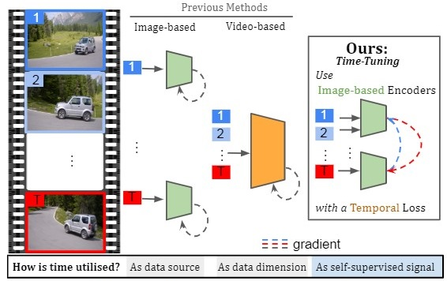


## GPU Requirements

<a name="gpu-requirements"></a>
Optimizing with our model, ***TimeT***, does not necessitate a significant GPU budget. Our training process is conducted on a single NVIDIA GeForce RTX 3090.


## Training

<a name="training-process"></a>

To start training from scratch, execute `time_tuning.py`. By default, the argument values are set for single GPU training without the utilization of an Exponential Moving Average (EMA) teacher, and no queue is used. However, activating these features has been observed to yield a slight performance enhancement on certain datasets, like [MOSE](https://henghuiding.github.io/MOSE/). The validation performance is logged every four epochs, while the loss is recorded with each iteration.

The training starts by running the following command :

```python
python time_tuning.py
```

To modify various training parameters such as the number of training prototypes, whether to add or remove the queue or EMA teacher, the presence of a projection head, or the number of clip frames, you can directly add the relevant arguments to your execution command :

```python
python time_tuning.py --num_clusters 200 --use_queue False --use_teacher True --use_projection_head True --num_frames 4
```


# Loading pretrained models
<a name="how-to-use"></a>
Our pretrained model (ViT-S16) can be found [here](https://www.dropbox.com/scl/fi/nnx2mm8ian9w49vstpgz0/TimeT.pth?rlkey=w9q3hvxd51nb63ammy33qhry0&dl=0). To use TimeT embeddings on downstream dense prediction tasks, you just need to install timm and torch and run:
```python
import torch
from timm.models.vision_transformer import vit_small_patch16_224
path_to_checkpoint = "<your path to downloaded ckpt>"
model = vit_small_patch16_224()
state_dict = torch.load(path_to_checkpoint)
model.load_state_dict({".".join(k.split(".")[2:]): v for k, v in state_dict.items()}, strict=False)
# Now you can call model.forward_features(batch) to get semantically rich image patch embeddings 
# of 16x16 pixel each

```

# Datasets

<a name="datasets"></a>

In the following sections, we provide a comprehensive guide that outlines the specific structures that your datasets should emulate, complete with illustrative examples. Adhering to these guidelines will ensure your dataset is appropriately formatted, thereby preventing potential complications during the training phase of our model.

For datasets that don't naturally conform to this structure, such as VISOR, we've accommodated this by providing a useful code snippet to aid the conversion process. More detailed information can be found by referring to the link below:

[Dataset Structures](dataset_README.md)

# Adjusting Paths in the Data Loader

<a name="adjusting-paths"></a>

You can adjust the paths of your dataset as has been set in the function `make_loader` in `data_loader.py`. To ensure accurate loading, this function should be set to point directly to the root of your dataset, specifically to the `JPEGImages` and `Annotations` for images and labels, respectively. If this path is incorrect, the dataloader will not be able to find and load your dataset correctly.

The correct configuration of this path is crucial. If the directory `JPEGImages` contains videos rather than images, the dataloader will automatically react. It generates distinct subdirectories, each named after a video, and fills these with the corresponding video frames. Moreover, the dataloader determines whether the given path is for an unconverted video dataset or a correctly converted image dataset. It does so by counting the depth of the directories it needs to traverse to reach video or image files. This counting helps it discern the type of data to handle.

Please ensure that the paths you provide are correct and accurately point to your dataset's location.


# Requirements

<a name="requirements"> </a>

We recommend to use conda for installing the requirements. If you haven't installed conda yet, you can find instructions [here](https://www.anaconda.com/download). The steps for installing the requirements are:

1 - Create a new environment from the provided YAML file:

```python
conda env create -f environment.yml
```

2 - Activate the environment:

```
conda activate Timetuning
```

# Evaluation

<a name="evaluation"></a>

1 - To replicate the results presented in the paper, you'll need to use `evaluation.py`, `linear_finetune.py`, and `cluster_based_foreground_extraction.py`.

2 - For per-dataset evaluations on Pascal VOC, certain lines should be uncommented in `evaluation.py`. These lines have been clearly indicated within the code.

3 - For video datasets, pass the `dataset_name + _val` argument to the `make_loader` function in `data_loader.py`. This will allow you to load the validation set.

For accurate replication of our results, please adhere to the following instructions. We've set all arguments to their default values for your convenience. However, if you wish to alter the number of inference clusters, such as in clustering or overclustering experiments, you may utilize the command detailed below : 

```python
python evaluation.py --num_clusters 21
```

For overclustering experiment ```many_to_one``` and ```precision_based``` should be set to **True**. 

If you're keen on visualizing the samples, this can be readily achieved. Simply pass the appropriate  ```logging_directory```  as an argument to the ``` evaluate_localizations```. function. Please note that the default value is currently set to  **None**.


# Visualizations

<a name="visualizations"> </a>

For more visualizations please download the visualizations folder.


|    |    |    |
|:--:|:--:|:--:|
| 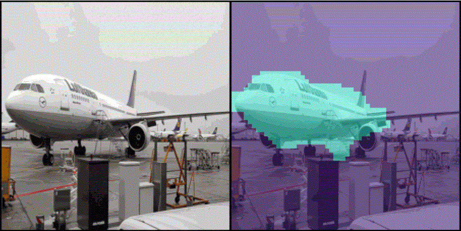 | 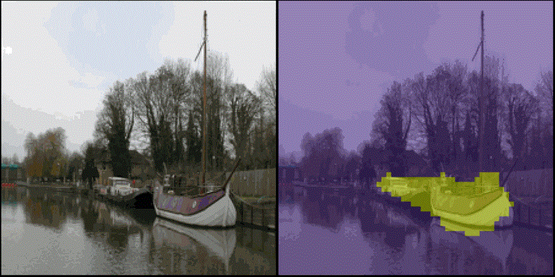  |  |
|  | 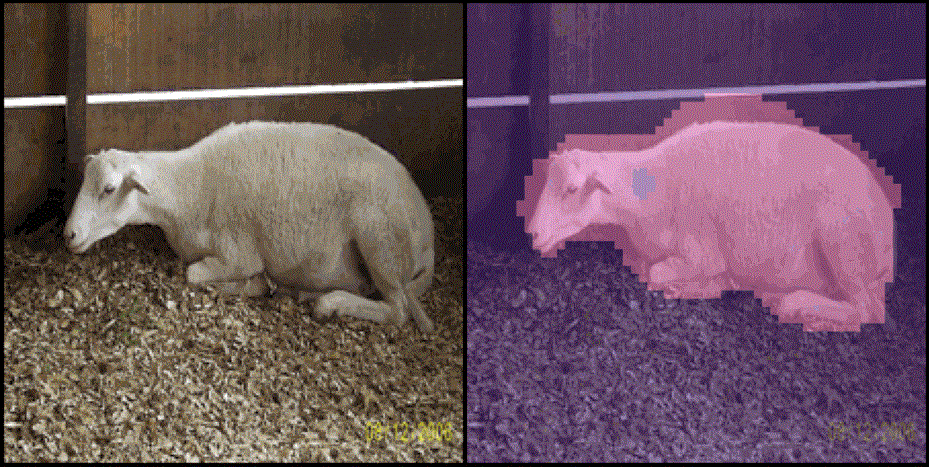 |  |
| 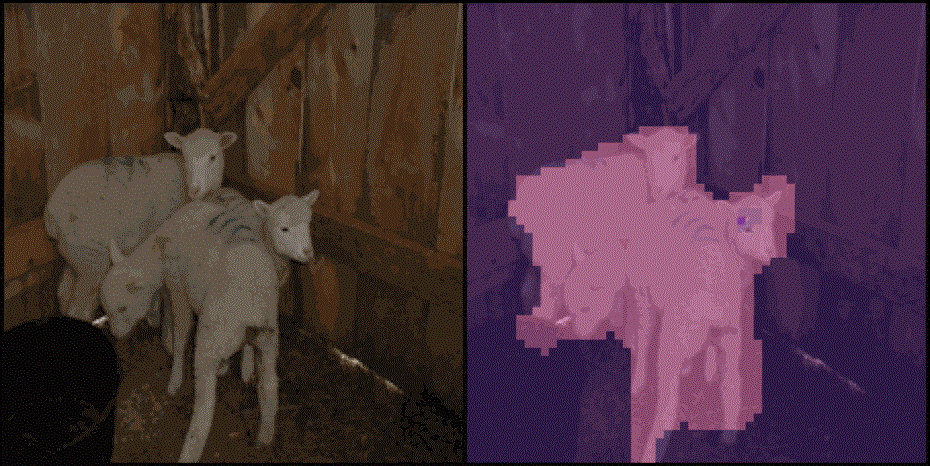  | 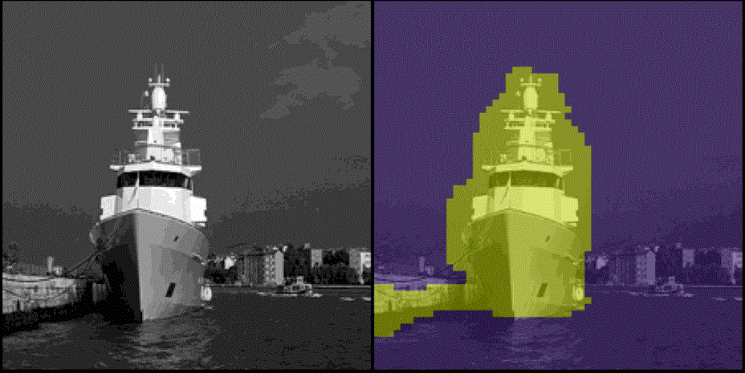 | 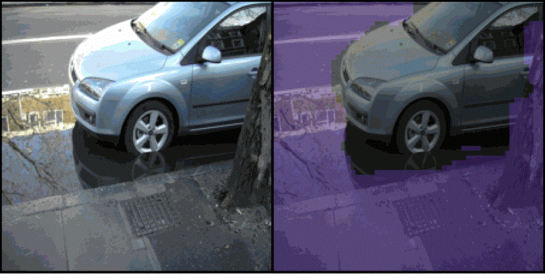 |


<table>

</table>


<table>
<tr>
<td align="center">Input</td>
<td align="center">DINO</td>
<td align="center">Leopart</td>
<td align="center">TimeT</td>
</tr>
<tr>
<td>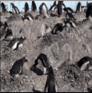</td>
<td>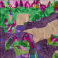</td>
<td>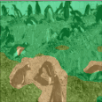</td>
<td>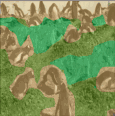</td>
</tr>
</table>


# Citation

<a name="citation"> </a>

If you find this repository useful, please consider giving a star ⭐ and citation 📣:
``` 
@article{salehi2023time,
   title        = {Time Does Tell: Self-Supervised Time-Tuning of Dense Image Representations},
   author       = {Salehi, Mohammadreza and Gavves, Efstratios and Snoek, Cees G. M. and Asano, Yuki M.},
   year         = {2023},
   journal    = {ICCV},
}

```
